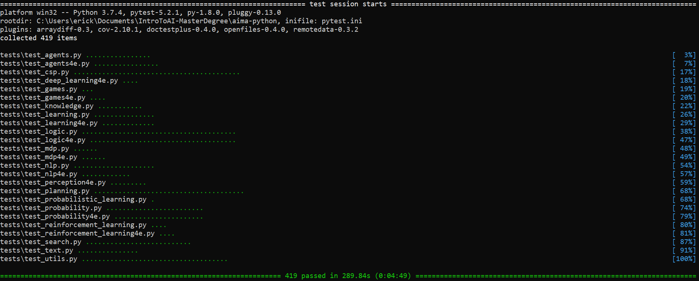
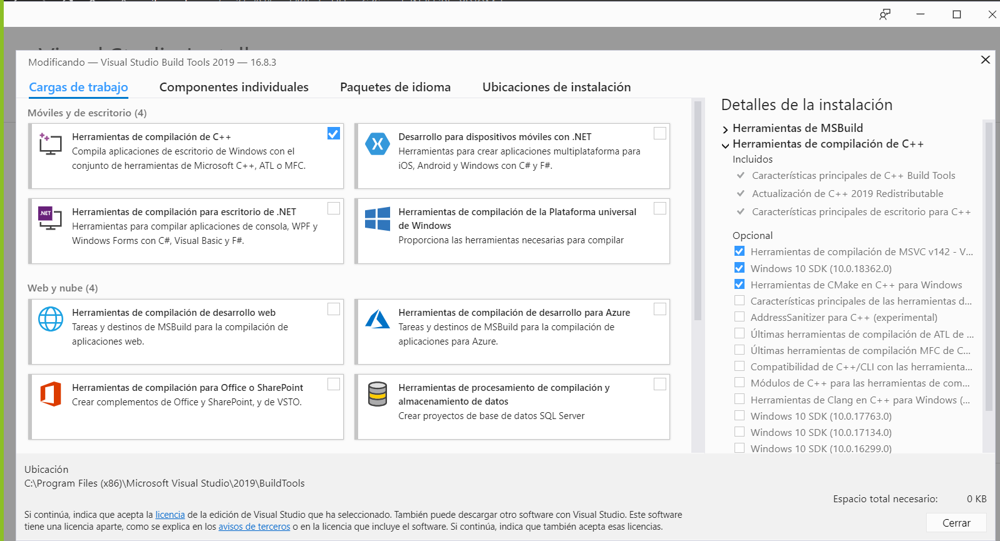

# **Introducción a la Inteligencia Artificial - Curso de Maestría**

## **Ejecución Local**
------------------------------------------------------------------------------

### **Antes de iniciar**
Debe asegurarse de tener instalado Git en su computadora. Si no lo tiene,
puede descargarlo [aquí](https://git-scm.com/downloads).

### **Instalación**
1. Descargar [Anaconda](https://repo.anaconda.com/archive/Anaconda3-2019.10-Windows-x86_64.exe).
2. Instalar Anaconda en `C:\Users\<Usuario>\Anaconda3`. Cuando se realiza la
instalación, debe marcar la opcion que dice "Registrar Anaconda como mi
Python 3.7 por defecto". Confirmar la instalación y esperar a que termine.
3. Crear un directorio de trabajo y asegurarse de que los scripts `setup.bat`
e `install.bat` estén dentro de este. También puede clonar el repositorio y
usar la carpeta creada como folder de trabajo (`git clone https://github.com/ErickOF/Introduction-to-AI-Master-Degree.git`).
4. Ejecutar en el directorio de trabajo, el script `setup.bat` en una terminal
de Windows.
5. Posteriormente, ejecutar el script `install.bat`
6. Si todo salió correctamente, deberá ver un mensaje verde al final diciendo:
`419 passed in xs (0:xx:xx)`.

### **Posibles fallos**

#### **Se requiere una versión de Visual C++ 2014 o superior**

Para solventar lo de la versión de Visual C++ existen dos posibles opciones:

* Si se tiene instalado Visual Studio Community, se puede abrir Visual Studio
Installer y actualizar las herramientas de Compilación de C++. Cuando termine
se debe reiniciar la computadora, abrir una terminal nueva y realizar del
paso 3 en adelante.

* De no tener instalado Visual Studio Community, se debe descargar Visual
Studio Community 2015 o superior (se recomienda esta última), con las
herramientas de Compilación de C++. Si no se quiere instalar esto, se debe ir
a la página oficial de Microsoft y descargar todas las herramientas de
compilación por a parte, esto se puede hacer [aquí](https://visualstudio.microsoft.com/visual-cpp-build-tools/).

## **Códigos en Google Colab**
------------------------------------------------------------------------------
Estos códigos son tomados del repositorio [aimacode/aima-python][aima] y
pasados a Google Colab para utilizarlos de forma más sencilla sin instalar
ningún paquete en el ordenador. Como se indica en el repositorio, los archivos
con un asterisco denotan que los algoritmos no están implementados en su
totalidad. Los datasets pueden descargarse en [aimacode/aima-data][aima-data].

| **Capítulo** | **Nombre (3era edición)** |      **Nombre (repositorio)**      |           **Enlace**          |
|:-------------|:-------------------------------------|:-----------------------------------|:------------------------------|
| 2            | Random-Vacuum-Agent                  | `RandomVacuumAgent`                | [agents.py][agents]           |
| 2            | Model-Based-Vacuum-Agent             | `ModelBasedVacuumAgent`            | [agents.py][agents]           |
| 2.1          | Environment                          | `Environment`                      | [agents.py][agents]           |
| 2.1          | Agent                                | `Agent`                            | [agents.py][agents]           |
| 2.3          | Table-Driven-Vacuum-Agent            | `TableDrivenVacuumAgent`           | [agents.py][agents]           |
| 2.7          | Table-Driven-Agent                   | `TableDrivenAgent`                 | [agents.py][agents]           |
| 2.8          | Reflex-Vacuum-Agent                  | `ReflexVacuumAgent`                | [agents.py][agents]           |
| 2.10         | Simple-Reflex-Agent                  | `SimpleReflexAgent`                | [agents.py][agents]           |
| 2.12         | Model-Based-Reflex-Agent             | `ReflexAgentWithState`             | [agents.py][agents]           |
| 3            | Problem                              | `Problem`                          | [search.py]                   |
| 3            | Node                                 | `Node`                             | [search.py]                   |
| 3            | Queue                                | `Queue`                            | [utils.py]                    |
| 3.1          | Simple-Problem-Solving-Agent         | `SimpleProblemSolvingAgent`        | [search.py]                   |
| 3.2          | Romania                              | `romania`                          | [search.py]                   |
| 3.7          | Tree-Search                          | `depth/breadth_first_tree_search`  | [search.py]                   |
| 3.7          | Graph-Search                         | `depth/breadth_first_graph_search` | [search.py]                   |
| 3.11         | Breadth-First-Search                 | `breadth_first_graph_search`       | [search.py]                   |
| 3.14         | Uniform-Cost-Search                  | `uniform_cost_search`              | [search.py]                   |
| 3.17         | Depth-Limited-Search                 | `depth_limited_search`             | [search.py]                   |
| 3.18         | Iterative-Deepening-Search           | `iterative_deepening_search`       | [search.py]                   |
| 3.22         | Best-First-Search                    | `best_first_graph_search`          | [search.py]                   |
| 3.24         | A\*-Search                           | `astar_search`                     | [search.py]                   |
| 3.26         | Recursive-Best-First-Search          | `recursive_best_first_search`      | [search.py]                   |
| 4.2          | Hill-Climbing                        | `hill_climbing`                    | [search.py]                   |
| 4.5          | Simulated-Annealing                  | `simulated_annealing`              | [search.py]                   |
| 4.8          | Genetic-Algorithm                    | `genetic_algorithm`                | [search.py]                   |
| 4.11         | And-Or-Graph-Search                  | `and_or_graph_search`              | [search.py]                   |
| 4.21         | Online-DFS-Agent                     | `online_dfs_agent`                 | [search.py]                   |
| 4.24         | LRTA\*-Agent                         | `LRTAStarAgent`                    | [search.py]                   |
| 5.3          | Minimax-Decision                     | `minimax_decision`                 | [games.py]                    |
| 5.7          | Alpha-Beta-Search                    | `alphabeta_search`                 | [games.py]                    |
| 6            | CSP                                  | `CSP`                              | [csp.py]                      |
| 6.3          | AC-3                                 | `AC3`                              | [csp.py]                      |
| 6.5          | Backtracking-Search                  | `backtracking_search`              | [csp.py]                      |
| 6.8          | Min-Conflicts                        | `min_conflicts`                    | [csp.py]                      |
| 6.11         | Tree-CSP-Solver                      | `tree_csp_solver`                  | [csp.py]                      |
| 7            | KB                                   | `KB`                               | [logic.py]                    |
| 7.1          | KB-Agent                             | `KB_AgentProgram`                  | [logic.py]                    |
| 7.7          | Propositional Logic Sentence         | `Expr`                             | [utils.py]                    |
| 7.10         | TT-Entails                           | `tt_entails`                       | [logic.py]                    |
| 7.12         | PL-Resolution                        | `pl_resolution`                    | [logic.py]                    |
| 7.14         | Convert to CNF                       | `to_cnf`                           | [logic.py]                    |
| 7.15         | PL-FC-Entails?                       | `pl_fc_entails`                    | [logic.py]                    |
| 7.17         | DPLL-Satisfiable?                    | `dpll_satisfiable`                 | [logic.py]                    |
| 7.18         | WalkSAT                              | `WalkSAT`                          | [logic.py]                    |
| 7.20         | Hybrid-Wumpus-Agent                  | `HybridWumpusAgent`                |                               |
| 7.22         | SATPlan                              | `SAT_plan`                         | [logic.py]                    |
| 9            | Subst                                | `subst`                            | [logic.py]                    |
| 9.1          | Unify                                | `unify`                            | [logic.py]                    |
| 9.3          | FOL-FC-Ask                           | `fol_fc_ask`                       | [logic.py]                    |
| 9.6          | FOL-BC-Ask                           | `fol_bc_ask`                       | [logic.py]                    |
| 10.1         | Air-Cargo-problem                    | `air_cargo`                        | [planning.py]                 |
| 10.2         | Spare-Tire-Problem                   | `spare_tire`                       | [planning.py]                 |
| 10.3         | Three-Block-Tower                    | `three_block_tower`                | [planning.py]                 |
| 10.7         | Cake-Problem                         | `have_cake_and_eat_cake_too`       | [planning.py]                 |
| 10.9         | Graphplan                            | `GraphPlan`                        | [planning.py]                 |
| 10.13        | Partial-Order-Planner                | `PartialOrderPlanner`              | [planning.py]                 |
| 11.1         | Job-Shop-Problem-With-Resources      | `job_shop_problem`                 | [planning.py]                 |
| 11.5         | Hierarchical-Search                  | `hierarchical_search`              | [planning.py]                 |
| 11.8         | Angelic-Search                       | `angelic_search`                   | [planning.py]                 |
| 11.10        | Doubles-tennis                       | `double_tennis_problem`            | [planning.py]                 |
| 13           | Discrete Probability Distribution    | `ProbDist`                         | [probability.py]              |
| 13.1         | DT-Agent                             | `DTAgent`                          | [probability.py]              |
| 14.9         | Enumeration-Ask                      | `enumeration_ask`                  | [probability.py]              |
| 14.11        | Elimination-Ask                      | `elimination_ask`                  | [probability.py]              |
| 14.13        | Prior-Sample                         | `prior_sample`                     | [probability.py]              |
| 14.14        | Rejection-Sampling                   | `rejection_sampling`               | [probability.py]              |
| 14.15        | Likelihood-Weighting                 | `likelihood_weighting`             | [probability.py]              |
| 14.16        | Gibbs-Ask                            | `gibbs_ask`                        | [probability.py]              |
| 15.4         | Forward-Backward                     | `forward_backward`                 | [probability.py]              |
| 15.6         | Fixed-Lag-Smoothing                  | `fixed_lag_smoothing`              | [probability.py]              |
| 15.17        | Particle-Filtering                   | `particle_filtering`               | [probability.py]              |
| 16.9         | Information-Gathering-Agent          | `InformationGatheringAgent`        | [probability.py]              |
| 17.4         | Value-Iteration                      | `value_iteration`                  | [mdp.py]                      |
| 17.7         | Policy-Iteration                     | `policy_iteration`                 | [mdp.py]                      |
| 17.9         | POMDP-Value-Iteration                | `pomdp_value_iteration`            | [mdp.py]                      |
| 18.5         | Decision-Tree-Learning               | `DecisionTreeLearner`              | [learning.py]                 |
| 18.8         | Cross-Validation                     | `cross_validation`                 | [learning.py] \*              |
| 18.11        | Decision-List-Learning               | `DecisionListLearner`              | [learning.py] \*              |
| 18.24        | Back-Prop-Learning                   | `BackPropagationLearner`           | [learning.py]                 |
| 18.34        | AdaBoost                             | `AdaBoost`                         | [learning.py]                 |
| 19.2         | Current-Best-Learning                | `current_best_learning`            | [knowledge.py]                |
| 19.3         | Version-Space-Learning               | `version_space_learning`           | [knowledge.py]                |
| 19.8         | Minimal-Consistent-Det               | `minimal_consistent_det`           | [knowledge.py]                |
| 19.12        | FOIL                                 | `FOIL_container`                   | [knowledge.py]                |
| 21.2         | Passive-ADP-Agent                    | `PassiveADPAgent`                  | [rl.py]                       |
| 21.4         | Passive-TD-Agent                     | `PassiveTDAgent`                   | [rl.py]                       |
| 21.8         | Q-Learning-Agent                     | `QLearningAgent`                   | [rl.py]                       |
| 22.1         | HITS                                 | `HITS`                             | [nlp.py]                      |
| 23           | Chart-Parse                          | `Chart`                            | [nlp.py]                      |
| 23.5         | CYK-Parse                            | `CYK_parse`                        | [nlp.py]                      |
| 25.9         | Monte-Carlo-Localization             | `monte_carlo_localization`         | [probability.py]              |

## **Reportar fallos**

Por favor reporte cualquier error o fallo que tenga [aquí](https://github.com/ErickOF/Introduction-to-AI-Master-Degree/issues/new?assignees=ErickOF&labels=bug&template=reportar-fallo.md&title=%5BBUG%5D).

<!---Reference Links-->
[agents]:https://colab.research.google.com/drive/1BAKBUAOQMfwn4YGS5OjdbcS4YOV_ZWd-?usp=sharing
[aima]:https://github.com/aimacode/aima-python
[aima-data]:https://github.com/aimacode/aima-data
[csp]:.
[games]:.
[grid]:.
[knowledge]:.
[learning]:.
[logic]:.
[mdp]:.
[nlp]:.
[planning]:.
[probability]:.
[rl]:.
[search]:.
[utils]:.
[text]:.
